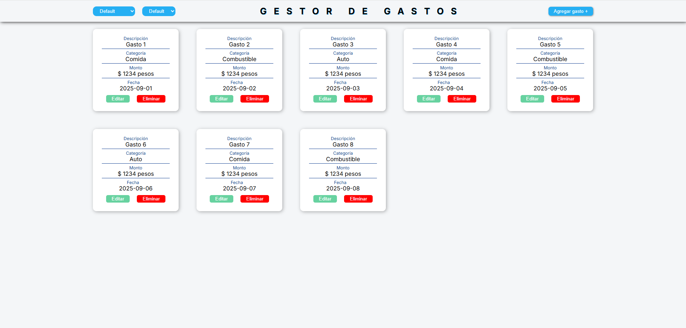

# Gestor de Gastos 📊

Aplicación web simple para registrar y llevar un control de los gastos personales. Permite añadir, editar, eliminar y filtrar gastos. Este proyecto fue construido para consolidar los fundamentos de HTML, CSS y JavaScript, con un enfoque en el diseño responsivo y las buenas prácticas de desarrollo.

## Demo en Vivo 🚀

*(Próximamente... En nuestra siguiente misión, desplegaremos el sitio y pondremos el link aquí.)*

## Captura de Pantalla 📸

## Tecnologías Utilizadas 🛠️

* **HTML5:** Para la estructura y semántica del contenido.
* **CSS3:** Para el diseño, layout (Flexbox/Grid) y la responsividad.
* **JavaScript (Vanilla):** Para toda la lógica interactiva, manipulación del DOM y gestión de datos en `localStorage`.
* **Git y GitHub:** Para el control de versiones y el flujo de trabajo de desarrollo.